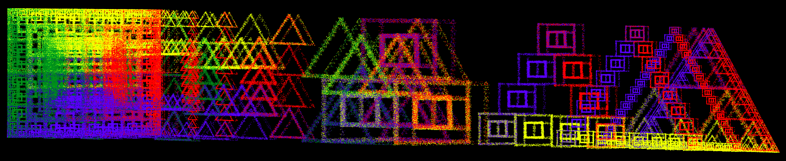
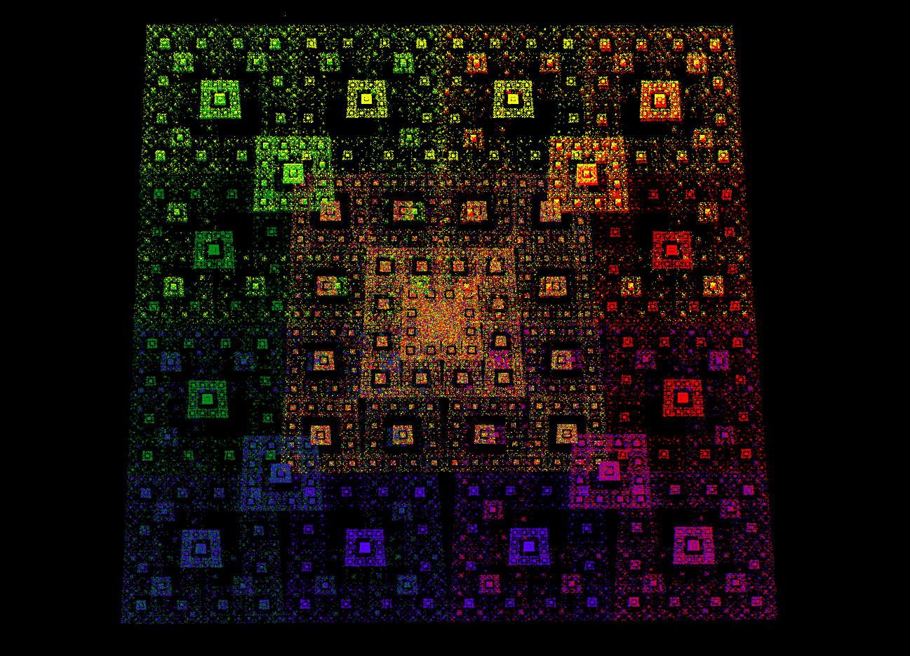
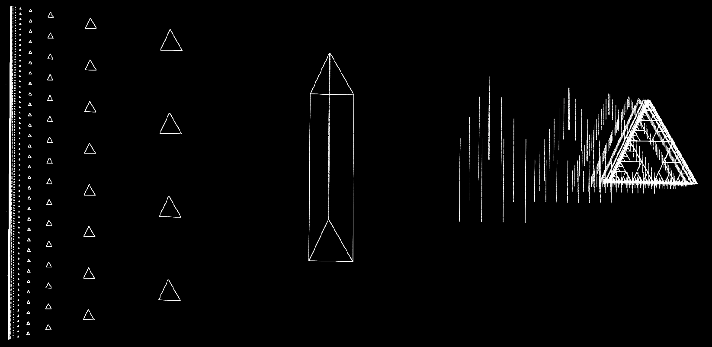
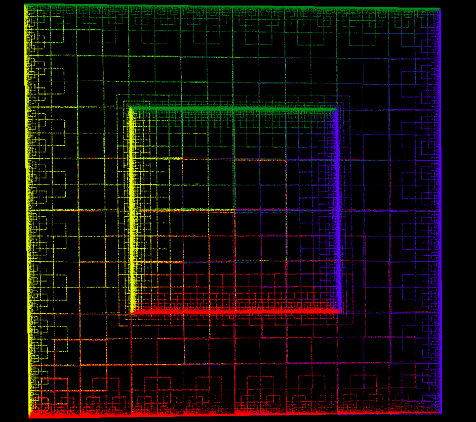
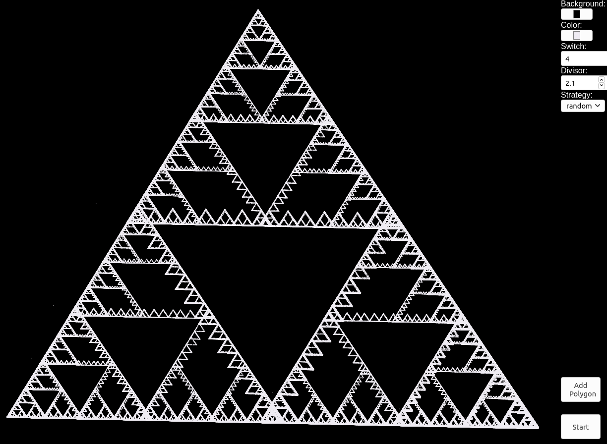

# Chaos Game - Desktop Browser App
You can play with this app in your web browser, preferably on a laptop / desktop:

https://josvromans.github.io/webapps/webchaos/app.html

In addition to the regular Chaos Game (<a href="https://www.youtube.com/watch?v=kbKtFN71Lfs">explanation on YouTube</a>),
you can add several polygons / lines / points that interplay with each other.

**Parameters**

Background color: sets the canvas background color


Color: sets the color of the current polygon, at the moment when &lt;space&gt; is hit (see the controls section)


Switch: the number of iterations after which the Chaos Game will switch from the current polygon to another polygon.


Divisor: when the divisor is 2, every next point will be drawn halfway the previous point, and the selected random corner point.


Strategy: The 'random' option will switch to a random nexy polygon, where every polygon (even the current one) has the same chance.
The 'next' option will always switch to the next polygon (in order of addition), and after the last polygon, the next one will be the first polygon.


**Controls**

Mouse click (or finger on tablet/phone) to add single points on the canvas.


&lt;space&gt; to make a closed polygon of all the points so far.
To add more polygons, add more points and hit &lt;space&gt; again.
To add a single point, you have to hit &lt;space&gt; after a single mouse click.
Every time when you hit &lt;space&gt; the polygon will be drawn in the selected 'color'. So you can make something colorful by selecting a different color every time.
There is a button 'add polygon' with the same effect (for if you are on a device without a keyboard).


&lt;enter&gt; to start the chaos game. This can take a few seconds.


&lt;F5&gt; To start over with a blank canvas (by just refreshing the page)


<ctrl + c> will copy the list of polygons to the clipboard. So this can also be used as a tool to 'hand draw' some figures, and then use the coordinates in another program.
The structure is a Python compatible list of lists of tuples (where each tuple is a point, each list of tuples is a polygon, and the whole is a list of polygons).
For example:

```python
polygon_list = [
    [
        (100, 100),
        (500, 100),
        (500, 500),
    ],
]
```

**A few examples**






